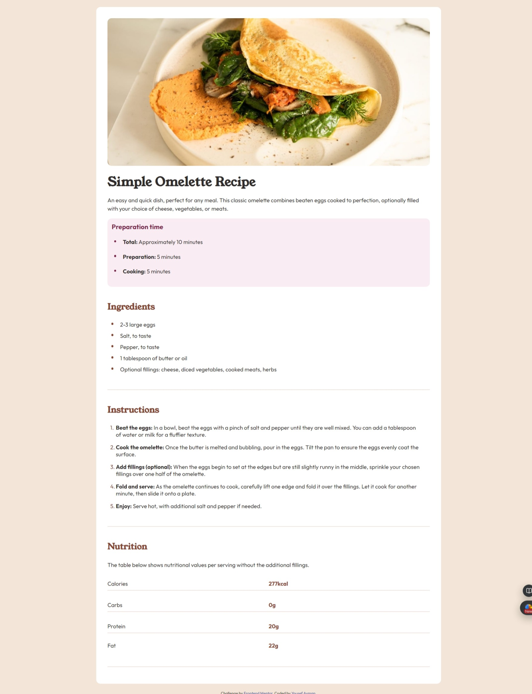

# Frontend Mentor - Recipe page solution

This is a solution to the [Recipe page challenge on Frontend Mentor](https://www.frontendmentor.io/challenges/recipe-page-KiTsR8QQKm). Frontend Mentor challenges help you improve your coding skills by building realistic projects.

## Overview

a simple recipe page which I used html and css to build

### Screenshot

### Links

- Solution URL: [Add solution URL here](https://github.com/Yussif20/Recipte_page)
- Live Site URL: [Add live site URL here](https://recipe-page-dazai.netlify.app/)

### Built with

- Semantic HTML5 markup
- CSS custom properties
- Flexbox

## Author

- github - [Yousef Ayman](https://github.com/Yussif20)
  -linkedin - [Yousef Ayman](https://www.linkedin.com/in/yussif-ayman/)
